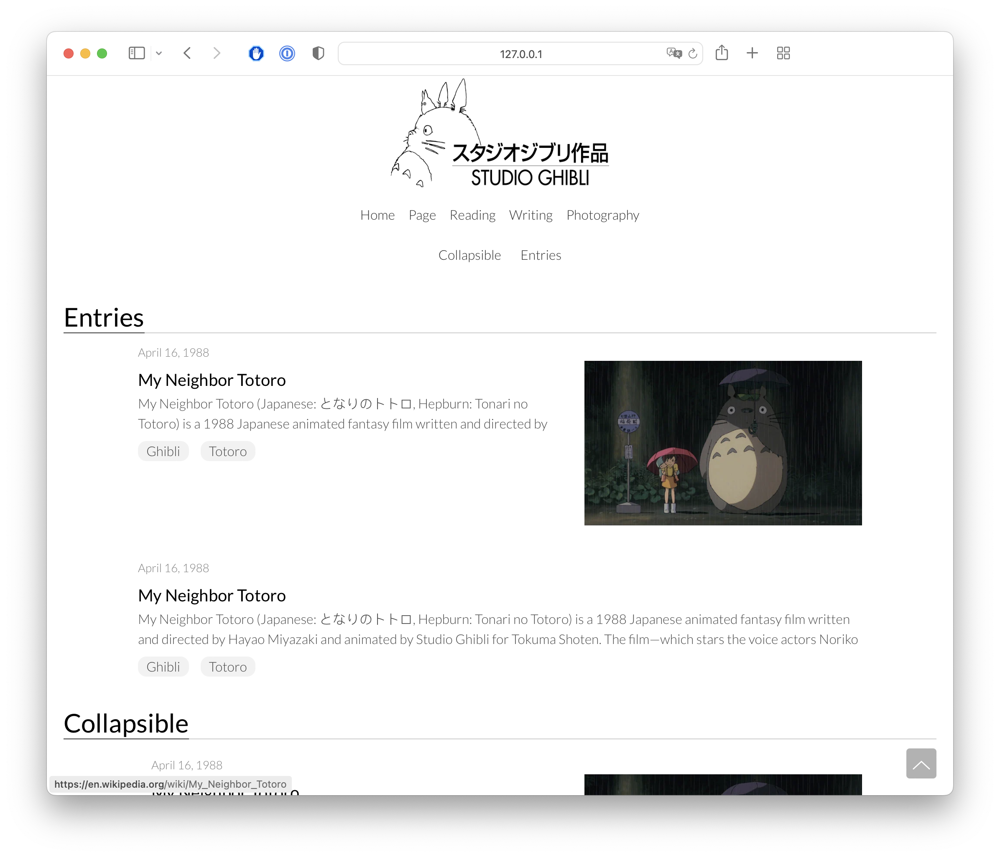

# Jekyll Yōuyǎ theme

Yōuyǎ is an elegant profile theme for Jekyll.

## Demo

[You can see a live demo of the site in action here.](...)




## Get started

Install theme in the main directory:
```
bundle install
```
Then set the theme in your `_config.yml` file:
```
theme: youya
```
Then set the following required fields (see also the example `_config.yml` in the `test` folder):

* Background images: The background image is read from a folder under `assets/img` in your site loads a random image each time: `0000.jpeg`,`0001.jpeg`,.... In your `_config.yml`:
    ```
    background_img_folder: background_imgs
    no_background_images: 2
    ```

* Logo images: both black and white logo images should be provided, referring to `assets/img`:
    ```
    logo_black: logo_black.png
    logo_white: logo_white.png
    ```

* Favicon in assets folder should be 32x32 pixels:
    ```
    favicon: favicon.png
    ```

* Menu: this is the main navigation menu:
    ```
    menu:
    - home:
        title: Home
        url: index.html
    - page:
        title: Page
        url: page.html
    - reading:
        title: Reading
        url: reading.html
    - writing:
        title: Writing
        url: writing.html
    - photography:
        title: Photography
        url: photography.html
    ```

* About section text and image (referring to `assets/img` folder):
    ```
    about: "abcdef"
    about_img: profile.jpg
    ```

* Social links to GitHub, LinkedIn, Google Scholar:
    ```
    github_url: https://github.com
    linkedin_url: https://www.linkedin.com
    google_scholar_url: https://scholar.google.com
    ```

## Features

* Profile with sections for:
    * Entries for code, academic papers or projects, with links to GitHub & arXiv.
    * Reading book list
    * Writing blog entries
    * Photography
    * About
* Random background from a collection of images.
* Easily customizable.

## Tests

Install theme in the main directory:
```
bundle install
```
Then build the site from the `test` directory:
```
bundle exec jekyll serve
```

## Customization

The site is broken into many reusable sections in the `_include` directory. You can easily make your own `_layouts`. Refer to:

* Examples in the [_layouts](_layouts/) directory, and 
* The [liquid documentation.](https://shopify.github.io/liquid/tags/iteration/)